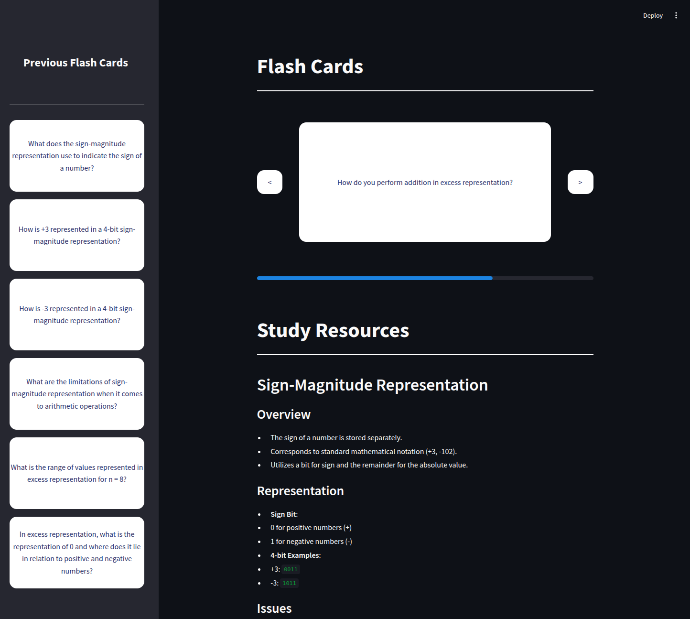

# Student Pilot
## Submission to the Royal Hackaway v8 Hackathon 



## About
Student Pilot is an AI-powered study tool that transforms your text files into interactive study cards and notes. Simply upload a file, and our AI extracts key questions and answers to generate flashcards, helping you reinforce your learning efficiently.

## Features
- AI-driven text analysis to generate study cards
- Interactive flashcards for effective learning
- Supports multiple file formats (e.g., PDFs, text files)
- Simple and intuitive web interface

## Requirements
Ensure you have the following dependencies installed before running the project:

- Python 3.12+
- Streamlit (Python Library)
- OpenAI (Python Library)
- PyPDF2 (Python Library)
- OpenAI API key
- Make

## Installation & Setup
Follow these steps to set up and run the project:

1. **Clone the repository:**
   ```sh
   git clone https://github.com/Aleks-Tacconi/StudentPilot.git
   ```
2. **Navigate to the project directory:**
   ```sh
   cd Hackathon-RoyalHolloway2025
   ```
3. **Create and activate a virtual environment:**
   ```sh
   python -m venv venv
   source venv/bin/activate  # On macOS/Linux
   venv\Scripts\activate  # On Windows
   ```
4. **Install dependencies:**
   ```sh
   pip install -r requirements.txt
   ```
5. **Set the OpenAI API key:**
   ```sh
   export OPENAI_API_KEY="your_api_key"  # On macOS/Linux
   set OPENAI_API_KEY="your_api_key"  # On Windows
   ```
6. **Run the project:**
   ```sh
   make run
   ```

Once the server starts, open your browser and navigate to `http://localhost:8501` to use the application.

## Team Members
- **Aleksander Tacconi** - [GitHub](https://github.com/Aleks-Tacconi)
- **Christopher White** - [GitHub](https://github.com/christopherwhite06)
- **Fawwaz Ahmed** - [GitHub](https://github.com/fawwaz1123)
- **Jessica Kanikaram** - [GitHub](https://github.com/jessicakanik)

## Devpost Submission
For more details and contributions, visit our [Devpost project page](https://devpost.com/software/ai-flashcards-6fjodu?ref_content=my-projects-tab&ref_feature=my_projects).

